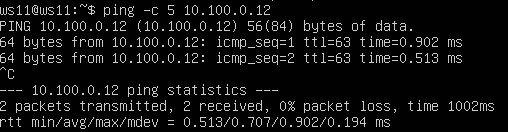
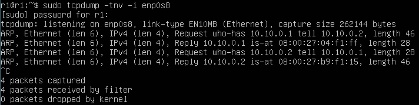
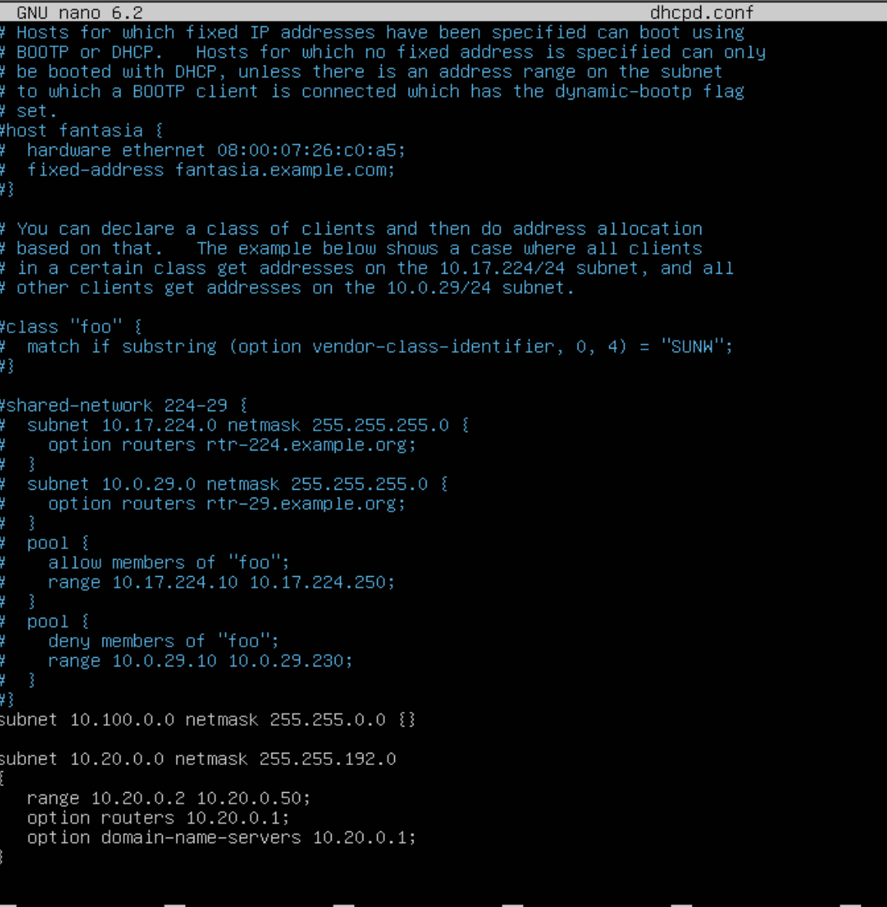
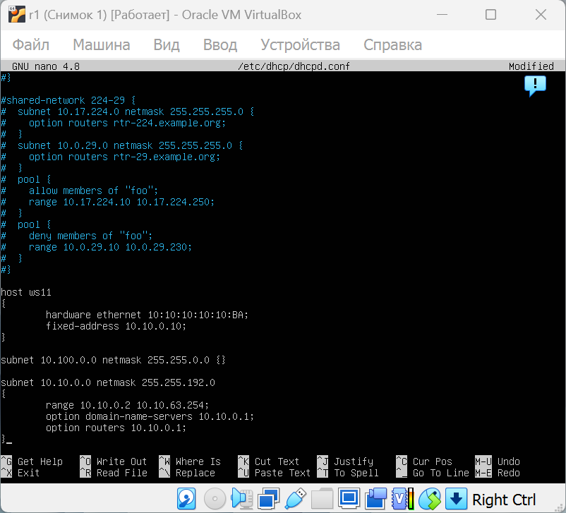

## **DO2_LinuxNetwork**

## Оглавление
- [Part 1. Инструмент ipcalc](#part-1-инструмент-ipcalc)
- [Part 2. Статическая маршрутизация между двумя машинами](#part-2-статическая-маршрутизация-между-двумя-машинами)
- [Part 3. Утилита iperf3](#part-3-утилита-iperf3)
- [Part 4. Сетевой экран](#part-4-сетевой-экран)
- [Part 5. Статическая маршрутизация сети](#part-5-статическая-маршрутизация-сети)
- [Part 6. Динамическая настройка IP с помощью DHCP](#part-6-динамическая-настройка-ip-с-помощью-dhcp)
- [Part 7. NAT](#part-7-nat)
- [Part 8. Дополнительно. Знакомство с SSH Tunnels](#part-8-дополнительно-знакомство-с-ssh-tunnels)
- [Конспект](#конспект)

## Part 1. Инструмент ipcalc

#### Поднимаем вирутальную машину ws1 и устанавливаем утилиту `ipcalc` 

- `sudo apt-get install ipcalc`
- `ipcalc` - это  утилита, используемая для вычисления и отображения информации о подсетях в сетях. Используется для определения сетевой информации, проверки корректности сетевых настроек, визуализации подсетей.  

### 1.1 Сети и маски

1) Определение адреса сети 192.167.38.54/13
- `ipcalc 192.167.38.54/13`
- Адрес сети - **192.167.38.54**
- `ipcalc 192.167.38.54/13 | grep Network`
- Network:  **192.160.0.0/13**


_NB! Флаг `-b` позволяет скрыть двоичный вывод._

2) (1) Перевод маски 255.255.255.0 в префиксную и двоичную запись, (2) /15 в обычную и двоичную, (3) 11111111.11111111.11111111.11110000 в обычную и префиксную  

- **(1) `ipcalc 0.0.0.0/255.255.255.0` в префиксную и двоичную запись**
- `ipcalc 192.167.38.54/13 | grep -e Address -e Netmask`
- **Префиксная запись** - `/24`
- **Двоичная запись** - `11111111.11111111.11111111.00000000`


- *Префиксная запись (CIDR, , Classless Inter-Domain Routing) -  это способ обозначения маски подсети, где после слэша указывается количество единиц в двоичной записи маски. Преимущества: упрощение записи, гибкость, совместимость с маршрутизацией*
- *Двоичная запись представляет маску подсети в виде последовательности нулей и единиц. Преимущества: точное понимание структуры сети, диагностика сетевых проблем*
        
- **(2) `ipcalc 0.0.0.0/15` - /15 в обычной и двоичной записи**
- **Обычная запись** - `255.254.0.0`
- **Двоичная запись** - `11111111.11111110.00000000.00000000`
-`ipcalc 0.0.0.0/15 | grep -e Netmask`


- **(3) Обычная форма двоичной записи 11111111.11111111.11111111.11110000 - **255.255.255.240****
- **Префиксная запись** - `28`
- `ipcalc 0.0.0.0/28 | grep -e Netmask`


* Посчитаем количество ненулевых бит в 11111111.11111111.11111111.11110000 и получим - 28. Обычная запись - `255.255.255.240`. Префиксная запись - `/28`.

- *Двоичная запись маски подсети показывает как делися сеть и какие IP-адреса могут быть использованы в ней. Префиксная запись /28 -> в маске подсети 28 единиц.*

####    1.1.3. Минимальный и максимальный хост в сети 12.167.38.4 при масках: /8, 11111111.11111111.00000000.00000000, 255.255.254.0 и /4
- **Маска /8:**

- *Первые 8 битов адреса используются для обозначения сети, а остальные 24 бита - для хостов.*
- *Подходит для очень крупных организаций, которые требуют большого количества IP-адресов.*

    `ipcalc 12.167.38.4/8`
    - **HostMin: 12.0.0.1**
    - **HostMax: 12.255.255.254**


- **Маска /11111111.11111111.00000000.00000000 (/16):**

-  *Первые 16 бит IP-адреса используются для обозначения сети, а оставшиеся 16 бит - для обозначения хостов.*
- *Используется для создания большой подсети.*

    `ipcalc 12.167.38.4/16`
    - **HostMin: 12.167.0.1**
    - **HostMax: 12.167.255.254**


- **Маска /255.255.254.0:**

- *Первые 23 бита IP-адреса используются для обозначения сети, а оставшиеся 9 бит - для обозначения хостов.*
- *Используется для создания средней по размеру подсети.*

    `ipcalc 12.167.38.4/255.255.254.0`
    - **HostMin: 12.167.38.1**
    - **HostMax: 12.167.39.254**


- **Маска /4:**

- *Первые 4 бита адреса используются для обозначения сети, а остальные 28 битов - для хостов.*
- *Обозначает еще более крупную сеть, которая охватывает значительную часть адресного пространства.*

    `ipcalc 12.167.38.4/4`
    - **HostMin: 0.0.0.1**
    - **HostMax: 15.255.255.254**


| Маска  | Минимальный хост | Максимальный хост |
|---| --- |---|
| */8* | 12.0.0.1 |12.255.255.254|
| *11111111.11111111.00000000.00000000* |  12.167.0.1 |12.167.255.254|
| *255.255.254.0*| 12.167.38.1|12.167.39.254|
| */4* | 0.0.0.1 |15.255.255.254|  

### 1.2 localhost

Определи и запиши в отчёт, можно ли обратиться к приложению, работающему на localhost, со следующими IP: 194.34.23.100, 127.0.0.2, 127.1.0.1, 128.0.0.1  

- `localhost` — это стандартное имя хоста, которое ссылается на текущий компьютер. В большинстве ОС IP-адрес 127.0.0.1.

- `127.0.0.0/8` — это блок адресов, зарезервированный для **loopback интерфейса**. Любые IP-адреса из этого диапазона будут направлены на текущий компьютер.

- localhost зарезервирован диапазон ip адресов от 127.0.0.1 до 127.255.255.254 включительно. Из этого можем сделать вывод, что мы сможем обратиться к приложениям, работающим со следующими ip: `127.0.0.2`, `127.1.0.1`.  

**Кратко:**
- 194.34.23.100: нельзя.
- 127.0.0.2: можно.
- 127.1.0.1: можно.
- 128.0.0.1: нельзя.  

####    1.2.1 `ipcalc 194.34.23.100`


- **Нет**, так как это внешний IP-адрес, который не относится к диапазону loopback адресов.

####    1.2.2 `ipcalc 127.0.0.2`

- **Да**, так как адрес принадлежит **loopback** диапазону `127.0.0.0/8`. 


####    1.2.3 `ipcalc 127.1.0.1`

- **Да**, так как адрес принадлежит **loopback** диапазону `127.0.0.0/8`. 


####    1.2.4 `ipcalc 128.0.0.1`

- **Нет**, так как это внешний IP-адрес, который не относится к диапазону loopback адресов.


### 1.3 Диапазоны и сегменты сетей

* Выведем информацию обо всех ip адресах с помощью команды `ipcalc <ip адрес>` 

- Нас интересует строка "Hosts/Net" и конкретно надпись "Private Internet", наличие которой говорит о том, что ip адрес принадлежит частной сети. 

####    1.3.1 Публичные и частные IP

- **Публичные IP**

- *IP-адреса, которые используются для идентификации устройств в глобальной сети Интернет и маршрутизации данных через Интернет.*

- `134.43.0.2`


- `172.0.2.1`


- `192.172.0.1`


- `172.68.0.2`


- `192.169.168.1`


- **Частные IP**

- *IP-адреса, которые предназначены для использования внутри локальной сети и не маршрутизируются в глобальной сети Интернет.*

- `10.0.0.45`


- ` 192.168.4.2`


- `172.20.250.4`


- `172.16.255.255`


- `10.10.10.10`


**Краткий отчет**
- Частные: 
    - 10.0.0.45, 
    - 192.168.4.2, 
    - 172.20.250.4, 
    - 172.16.255.255, 
    - 10.10.10.10 
- Публичные: 
    - 134.43.0.2, 
    - 172.0.2.1, 
    - 192.172.0.1, 
    - 172.68.0.2, 
    - 192.169.168.1

####    1.3.2 Какие из перечисленных IP адресов шлюза возможны у сети 10.10.0.0/18: 

- *Шлюз соединяет локальную сеть с другими сетями и должен иметь IP-адрес из диапазона той сети, к которой он подключен.*
- *У сети 10.10.0.0/18 диапазон от 10.10.0.1 до 10.10.63.254*

- (1)`10.0.0.1` - **Нет**
- *Адрес находится за пределами диапазона сети 10.10.0.0/18. (меньше HostMin)*


- (2)`10.10.0.2` - **Да**
- *Адрес входит в диапазон сети 10.10.0.0/18.*


- (3)`10.10.10.10` - **Да**
- *Адрес входит в диапазон сети 10.10.0.0/18.*


- (4)`10.10.100.1` - **Нет**
- *Адрес находится за пределами диапазона сети 10.10.0.0/18.  (больше HostMax)*


- (5)`10.10.1.255` - **Да**
- *Адрес входит в диапазон сети 10.10.0.0/18.*


---

## Part 2. Статическая маршрутизация между двумя машинами

> Связываем две машины, используя статическую маршрутизацию.

### 1.0.0 Поднимаем вирутальные машины ws1 и ws2

- Запускаем обе вирутальные машины  (далее -- ws1 и ws2).

### 1.0.1 С помощью команды ip a посмотри существующие сетевые интерфейсы.  

С помощью команды `ip a` смотрим существующие сетевые интерфейсы.


**Задаем настройки сети для ws1 и ws2:**

`sudo nano /etc/netplan/00-installer-config.yaml`
`ws1 - 192.168.100.10, маска /16`


`sudo nano /etc/netplan/00-installer-config.yaml`
`ws2 - 172.24.116.8, маска /12`


- **Задали адреса и маски**: ws1 - 192.168.100.10, маска /16, ws2 - 172.24.116.8, маска /12. **Перезапускаем сервис сети** для ws1 и ws2, сразу проверяем:

- `netplan apply`
- `ip a`


### 2.1. Добавление статического маршрута вручную

**Добавляем статический маршрут от ws1 к ws2:**

- ws1: `sudo ip r add 172.24.116.8 dev enp0s3`

**Добавляем статический маршрут от ws2 к ws1:**

- ws2: `sudo ip r add 192.168.100.10 dev enp0s3`

**Пропингуем соединение между машинами**

- ws1: `ping 172.24.116.8`
- ws2: `ping 192.168.100.10`

или `ping -c 4 [ip]`.  


- Виртуальные машины находятся в одной сети и обмениваются данными. 

### 2.2. Добавление статического маршрута с сохранением

- Перезапускаем машины.   

`sudo reboot`  

- Добавляем статический маршрут для обоих машин от одной машины до другой с помощью файла _/etc/netplan/00-installer-config.yaml._
- Пингуем соединение между машинами. 

- `sudo nano /etc/netplan/00-installer-config.yaml`
- `netplan apply`

-*Добавление статического маршрута через файл конфигурации /etc/netplan/00-installer-config.yaml позволяет сохранять настройки маршрутизации, чтобы они автоматически применялись при перезагрузке системы.*

- ws1 файл и пинг соединения


- ws2 файл и пинг соединения


---

## Part 3. Утилита iperf3

> Находим скорость соединения

### 1.0.0 Поднимаем вирутальные машины ws1 и ws2

### 3.1. Скорость соединения

**Переведи и запиши в отчёт: 8 Mbps в MB/s, 100 MB/s в Kbps, 1 Gbps в Mbps.**
- 8 Mbps = 1 MB/s;
- 100 MB/s = 819 200 Kbps;
- 1 Gbps = 1 024 Mbps.

### 3.2. Утилита iperf3

Измерь скорость соединения между ws1 и ws2.

В отчёт помести скрины с вызовом и выводом использованных команд.

- Измерь скорость соединения между ws1 и ws2.
- `sudo apt-get install iperf3`
- Выполняем команды на ws1 - `sudo iperf3 -s` и на ws 2 - `sudo iperf3 -c 192.168.100.10`

ws1 (в роли сервера):


ws2 (в роли клиента):


---

## Part 4. Сетевой экран
> _Сетевые экраны используются для контроля информации, проходящей по соединению._

### Поднимаем вирутальные машины ws1 и ws2

### 4.1. Утилита iptables

- Основное назначение `iptables` — это обеспечение безопасности сети через управление и фильтрацию сетевых пакетов.

- `sudo nano /etc/firewall.sh`
- `sudo chmod +x /etc/firewall.sh`
- `sudo /etc/firewall.sh`

- Создаем файлы /etc/firewall.sh, имитирующий фаерволл, на ws1 и ws2. Так же выводим перечень правил файервола командой sudo iptables -L.

- Стратегия для ws1: Запрещающее правило в начале, разрешающее правило в конце - изначально весь трафик блокируется, и только после этого разрешаются определённые виды трафика.

- Стратегия для ws2: Разрешающее правило в начале, запрещающее правило в конце - изначально весь трафик разрешён, и только после этого блокируются конкретные виды трафика.

для ws1:


для ws2:


Правила кратко:

1) на ws1 применить стратегию когда в начале пишется запрещающее правило, а в конце пишется разрешающее правило (это касается пунктов 4 и 5)
2) на ws2 применить стратегию когда в начале пишется разрешающее правило, а в конце пишется запрещающее правило (это касается пунктов 4 и 5)
3) открыть на машинах доступ для порта 22 (ssh) и порта 80 (http)
4) запретить echo reply (машина не должна "пинговаться”, т.е. должна быть блокировка на OUTPUT)
5) разрешить echo reply (машина должна "пинговаться")

- Если в начале файла написать запрещающее правило для echo-reply, а в конце - разрешающее правило, то все исходящие пакеты echo-reply будут блокироваться. Если в начале файла написать разрешающее правило, а в конце - запрещающее , то все исходящие пакеты будут разрешаться.

> Правила политик выполняются в очередности добавления в таблицы с правилами. В частности опция -A добавляет правила снизу таблицы (метод append), а вот опция -I добавляет правила вверх таблицы (метод insert). В частности запрещающее правило, расположенное перед разрешающим имеет приоритет и опция разрешающая какие либо пакеты работать не будет.

### 4.2. Утилита nmap

- Командой `ping` определили машину, которая не пингуется. Далее по адресу этой машины была выполнена утилита `nmap`, вывод которой показал что данная машина находится в сети.

    - ws1: `ping 172.24.116.8`
    - nmap -Pn 172.24.116.8

для ws1 (машина ws2 пингуется):


- для ws2 (машина ws1 не пингуется, соответственно с ее IP адресом запущена утилита nmap):


- `Host is up.` -> хост машины запущен.

- Сохраняем дампы образов виртуальных машин.

---

## Part 5. Статическая маршрутизация сети

- Подняты пять виртуальных машин (3 рабочие станции (ws11, ws21, ws22) и 2 роутера (r1, r2)), которые организованы в сеть в соответствии со схемой из задания. Соединения машин выполнены через 3 внутренних сети VirtualBox.

### Создадим сеть по схеме

 

### Поднять пять виртуальных машин (3 рабочие станции (ws11, ws21, ws22) и 2 роутера (r1, r2))

 

###  (!!!) В настройках VirtualBox предварительно добавляем сетевые адаптеры на машинах и роутерах "внутренняя сеть" в соответствии со схемой сети

**5.1. Настройка адресов машин**
Настроим конфигурации машин в `etc/netplan/00-installer-config.yaml`.  

- `sudo nano /etc/netplan/00-installer-config.yaml`
- `sudo netplan apply`

### ws11
  
### ws21
  
### ws22

### r1

### r2


Перезапустить сервис сети. Если ошибок нет, то командой ip -4 a проверить, что адрес машины задан верно. Также пропинговать ws22 с ws21. Аналогично пропинговать r1 с ws11.

Пропингуем ws22 с ws21. Аналогично пропинговать r1 с ws11

- `ip -4 a`
- ws22 & ws21: `ping -c 5 10.20.0.20`
- r1 & ws 11`ping -c 5 10.10.0.1`


**5.2. Включение переадресации IP-адресов**

`sysctl -w net.ipv4.ip_forward=1` включение переадресации IP на роутерах:
- `sudo sysctl -w net.ipv4.ip_forward=1`


`net.ipv4.ip_forward = 1` добавлено в файл */etc/sysctl.conf* на роутерах (r1, r2):


**5.3. Установка маршрута по-умолчанию**

Настроим маршрут по-умолчанию (шлюз) для рабочих станций. Для этого добавим `default` перед IP роутера в файле конфигураций *etc/netplan/00-installer-config.yaml*.

- `sudo nano /etc/sysctl.conf`
* добавляем шлюз для ws11   


* для ws21    


* для ws22 


Вызовим `ip r` и покажем, что добавился маршрут в таблицу маршрутизации.

- `sudo netplan apply`
- `ip r`

* ws11  

* ws21  

* ws22  


Пропингуем с ws11 роутер r2 и покажи на r2, что пинг доходит с помощью команды`tcpdump -tn -i enp0s5`

- r2: `sudo tcpdump -tn -i enp0s8`
- ws11: `ping 10.100.0.12`

Изменим eth1 на название нашего адаптера enp0s8 и пингуем: 
* ws11  
  
* r2    


**5.4. Добавление статических маршрутов**

Добавим в роутеры r1 и r2 статические маршруты в файле конфигураций. Пример для r1 маршрута в сетку 10.20.0.0/26:  
    # Добавить в конец описания сетевого интерфейса eth1:  
    - to: 10.20.0.0  
      via: 10.100.0.12  
r1 


r2 


Вызовим `ip r` и покажи таблицы с маршрутами на обоих роутерах.


Запустим команды на ws11: `ip r list 10.10.0.0/18` и `ip r list 0.0.0.0/0`

* команда `ip r list 10.10.0.0/[маска сети]`   

   

* команда `ip r list 0.0.0.0/0`  


* Маршрут по умолчанию имеет более низкий приоритет и срабатывает, когда не найден подходящий маршрут в таблице маршрутизации. Для сети 10.10.0.0 мы создали правило, соответственно используется созданный маршрут. Также можно устанавливать метрику, чтобы менять приоритеты маршрутов.  

**5.5. Построение списка маршрутизаторов**

#### Запустить на r1 команду дампа:  
`tcpdump -tnv -i eth0`  

#### При помощи утилиты traceroute построить список маршрутизаторов на пути от ws11 до ws21  
в первую очередь установим утилиту traceroute командой `sudo apt install traceroute`.
* вызов и вывод traceroute на ws11  
 

* вызов и вывод tcpdump -tnv -i enp0s9 на r1  
   
* Принцип построения пути при помощи traceroute:  
Для определения промежуточных маршрутизаторов traceroute отправляет серию пакетов данных целевому узлу, при этом каждый раз увеличивая на 1 значение поля TTL («время жизни»). Это поле обычно указывает максимальное количество маршрутизаторов, которое может быть пройдено пакетом. Первый пакет отправляется с TTL, равным 1, и поэтому первый же маршрутизатор возвращает обратно сообщение ICMP, указывающее на невозможность доставки данных. Traceroute фиксирует адрес маршрутизатора, а также время между отправкой пакета и получением ответа (эти сведения выводятся на монитор компьютера). Затем traceroute повторяет отправку пакета, но уже с TTL, равным 2, что позволяет первому маршрутизатору пропустить пакет дальше.  
Процесс повторяется до тех пор, пока при определённом значении TTL пакет не достигнет целевого узла. При получении ответа от этого узла процесс трассировки считается завершённым.  

**5.6. Использование протокола **ICMP** при маршрутизации**

#### Запустить на r1 перехват сетевого трафика, проходящего через eth0 с помощью команды:  
`tcpdump -n -i eth0 icmp`  

#### Пропинговать с ws11 несуществующий IP (например, 10.30.0.111) с помощью команды:  
`ping -c 1 10.30.0.111`  

* tcpdump на r1
Для того, чтобы увидеть ICMP echo request на роутере нужно прописать еще один маршрут на ws11 до какой-то условной подсети 10.30.0.0/24.  

   

* ping на ws11  

После отключения NAT можем увидеть сообщение +1 errors   


Сделаны снимки виртуальных машин

---

## Part 6. Динамическая настройка IP с помощью DHCP

* для начала скачаем isc-dhcp-server командой `sudo apt install isc-dhcp-server`

Для r2 настрой в файле */etc/dhcp/dhcpd.conf* конфигурацию службы **DHCP**:

- r2: `sudo nano /etc/dhcp/dhcpd.conf`, `sudo nano /etc/resolv.conf`



В файле *resolv.conf* пропиши `nameserver 8.8.8.8` и перезагрузим службу **DHCP** командой `systemctl restart isc-dhcp-server`

- `sudo apt-get update`, `sudo apt-get install isc-dhcp-server`
- r2: `sudo systemctl restart isc-dhcp-server`


Машину ws21 перезагрузим при помощи `reboot` и через `ip a` покажим, что она получила адрес. Также пропингуем ws22 с ws21.

- ws21: `sudo reboot`, `ip a`, `ping -c 4 10.20.0.2`
- ip адрес получен `enp0s8: 10.20.0.20/25` 


 #### Указать MAC адрес у ws11, для этого в etc/netplan/00-installer-config.yaml надо добавить строки: macaddress: 10:10:10:10:10:BA, dhcp4: true  
* вносим изменения в в _/etc/netplan/00-installer-config.yaml_  
  

#### Для r1 настроить аналогично r2, но сделать выдачу адресов с жесткой привязкой к MAC-адресу (ws11). Провести аналогичные тесты  
* Снова скачиваем isc-dhcp-server и вносим изменения в файл _/etc/dhcp/dhcpd.conf_  
  


* затем редактируем файл _/etc/resolv.conf_  
 


* перезагружаем службу DHCP  

Также в файле /etc/default/isc-dhcp-server укажем интерфейс enp0s8 для обслуживания dhcp-запросов

* перезагружаем ws11 и вызываем `ip a`

#### Запросить с ws21 обновление ip адреса  
* `ip a` на ws21 до обновления  


* вызываем команду `sudo dhclient enp0s8 -r`, потом `sudo dhclient enp0s8` и снова `ip a`  

* в данном пункте пользовался опцией -r для того, чтобы очистить список ip адресов. Видим изменение ip адреса на интерфейсе enp0s8.

- В данном пункте использованы следующие опции DHCP сервера:
    - subnet - указывает подсеть, для которой настраивается DHCP-сервер
    - netmask - указывает маску подсети для соответствующей подсети.
    - range - указывает диапазон IP-адресов, которые будут выдаваться DHCP-сервером клиентам в соответствующей подсети.
    - option routers - указывает IP-адрес шлюза по умолчанию для клиентов в соответствующей подсети.
    - option domain-name-servers - указывает IP-адрес DNS-сервера для клиентов в соответствующей подсети.
    - host - указывает конфигурацию для конкретного клиента, определяемого по MAC-адресу сетевого интерфейса.
    - hardware ethernet - указывает MAC-адрес сетевого интерфейса клиента.
    - fixed-address - указывает IP-адрес, который будет назначен конкретному клиенту.

---

## Part 7. NAT

> Механизм преобразования адресов

- ws22, r1: `sudo apt install apache2`
- `sudo vim /etc/apache2/ports.conf`

В файле */etc/apache2/ports.conf* на ws22 и r1 изменим строку `Listen 80` на `Listen 0.0.0.0:80`, то есть сделать сервер Apache2 общедоступным.


Запустим веб-сервер Apache командой `service apache2 start` на ws22 и r1.

Добавь в фаервол, созданный по аналогии с фаерволом из Части 4, на r2 следующие правила:
- r2: `sudo nano /etc/firewall.sh`
 - `sudo chmod +x /etc/firewall.sh`
- `sudo /etc/firewall.sh`

1) Удаление правил в таблице filter - `iptables -F`;
2) Удаление правил в таблице "NAT" - `iptables -F -t nat`;
3) Отбрасывать все маршрутизируемые пакеты - `iptables --policy FORWARD DROP`.
 Запустим файл также, как в Части 4.


Проверь соединение между ws22 и r1 командой `ping`. 


*При запуске файла с этими правилами, ws22 не должна «пинговаться» с r1.*

Добавь в файл ещё одно правило:  

4) Разрешить маршрутизацию всех пакетов протокола **ICMP**.
Запусти файл также, как в Части 4.
Проверь соединение между ws22 и r1 командой `ping`.


При запуске файла с этими правилами, ws22 должна «пинговаться» с r1.


Добавь в файл ещё два правила:  

5) Включи **SNAT**, а именно маскирование всех локальных ip из локальной сети, находящейся за r2 (по обозначениям из Части 5 - сеть 10.20.0.0).  

6) Включи **DNAT** на 8080 порт машины r2 и добавить к веб-серверу Apache, запущенному на ws22, доступ извне сети.

  

#### Запускать файл также, как в Части 4  
 

Проверить соединение по TCP для SNAT, для этого с ws22 подключиться к серверу Apache на r1 командой: ws22 `sudo service apache2 start`

Проверим соединение по TCP для **SNAT**: для этого с ws22 подключиться к серверу Apache на r1 командой:
`telnet 10.100.0.11 80`  


Проверим соединение по TCP для **DNAT**: для этого с r1 подключиться к серверу Apache на ws22 командой `telnet 10.100.0.12 8080`  


---

## Part 8. Дополнительно. Знакомство с SSH Tunnels

1. Зпускаем firewall из 7 части на r2 командами **sudo chmod +x /etc/firewall.sh & sudo bash /etc/firewall.sh**  


 
2. Изменяем файл **/etc/apache2/ports.conf** и запускаем сервер apache  
#### Запустить веб-сервер Apache на ws22 только на localhost (то есть в файле _/etc/apache2/ports.conf_ изменить строку `Listen 80` на `Listen localhost:80`)  
* вносим изменения в файл   

   

  

3. Используем **Local TCP forwarding** с ws21 до ws22, чтобы получить доступ к веб-серверу на ws22 с ws21.  
* воспользуемся командой `ssh -L [local_port]:localhost:[local_port] ws22@[remote_ip]`  
* проверим с помощью команды `telnet 127.0.0.1 5555`    

    

4. Используем **Remote TCP forwarding** c ws11 до ws22, чтобы получить доступ к веб-серверу на ws22 с ws11.  
* воспользуемся командой `ssh -R [remote_port]:localhost:[local_port] [remote_ip]`      

Проверяем соединение с помощью команды `telnet 127.0.0.1 22`     

 

--- 

                                                   end

---

## Конспект

### Как эмулировать сеть при помощи VirtualBox

#### Создание базовых виртуальных машин

1. **Создание виртуальной машины**:
   - Создай новую виртуальную машину, например, на основе Ubuntu Server 20.04 LTS.

2. **Клонирование виртуальной машины**:
   - Чтобы создать дополнительные виртуальные машины, щелкни правой кнопкой мыши на созданной виртуальной машине и выбери `Clone`.
   - В диалоговом окне укажи новое имя для клонированной ВМ и убедись, что в настройках выбрано создание нового MAC-адреса.
   - Выбери `Linked Clone` для экономии дискового пространства.
   - Нажми `Clone`, и новая ВМ появится в VirtualBox Manager.

3. **Повтори процесс** для создания всех требуемых виртуальных машин, предоставляя каждой уникальное имя.

4. **Настройка сетевых интерфейсов**:
   - Открой настройки каждой ВМ, чтобы настроить сетевые интерфейсы и подключить их к внутренним сетям VirtualBox.

#### Создание внутренних сетей VirtualBox

1. **Ограничения графического интерфейса**:
   - VirtualBox поддерживает до четырех сетевых адаптеров для каждой ВМ.

2. **Настройка сетевых адаптеров**:
   - Выбери виртуальную машину в VirtualBox Manager и перейди в `Settings` -> `Network`.
   - Установи флажок `Enable Network Adapter`, если он еще не установлен.
   - В разделе `Attached To` выбери `Internal Network`.

3. **Назначение имен внутренних сетей**:
   - Укажи имя внутренней сети, которое должно совпадать с именем, назначенным другим сетевым адаптерам, подключенным к этой сети.

4. **Настройка маршрутизаторов и ПК**:
   - Для маршрутизаторов используй три из четырех доступных сетевых адаптеров, чтобы подключиться к внутренним сетям.
   - Для ПК используй один сетевой адаптер.

#### Как добавить статические маршруты в Ubuntu Linux

1. **Добавление маршрута**:
   - Для временного добавления статического маршрута, используй команду:
     ```bash
     ip r add [адрес подключения] dev [имя сети]
     ```

2. **Постоянное добавление маршрута**:
   - Для сохранения маршрутов после перезагрузки добавь их в файл конфигурации сетевого интерфейса:
     - Открой файл конфигурации сетевого интерфейса, например, `/etc/netplan/01-netcfg.yaml`.
     - Добавь записи маршрутов под соответствующим сетевым интерфейсом. Пример конфигурации:
       ```yaml
       network:
         version: 2
         ethernets:
           eth0:
             addresses:
               - 192.168.1.10/24
             routes:
               - to: 10.1.1.0/24
                 via: 192.168.1.1
       ```

3. **Применение конфигурации**:
   - После внесения изменений в файл конфигурации, примените их с помощью команды:
     ```bash
     sudo netplan apply
     ```

Эти шаги помогут создать виртуальную сеть, настроить внутренние сети и обеспечить сохранность маршрутов в Ubuntu при помощи VirtualBox.

---

## Введение
**Стек протоколов TCP IP**   

- **Сеть** — это соединение двух или более устройств через каналы связи или сетевое оборудование.
- Обмен данными происходит по правилам, установленным стеком протоколов **TCP/IP**.
- Для разделения протоколов была разработана модель **OSI**, состоящая из семи уровней (физический, канальный, сетевой, транспортный, сеансовый, представительский, прикладной).

**Адресация**  
- В сети TCP/IP каждому хосту присваивается **IP-адрес** — это 32-битовое двоичное число. Удобная форма записи **IP-адреса (IPv4)** — четыре десятичных числа, разделенных точками (192.168.0.1).
- IP-адрес делится на две части: **адрес сети** **(подсети)** (с помощью маски подсети) и **адрес хоста** .  


- В сети TCP/IP есть **порт** — это числовая характеристика системного ресурса, выделенная приложению для связи с другими приложениями на различных хостах.
- **IP-протокол** отвечает за передачу и маршрутизацию информации в сети. Он упаковывает каждый блок информации (**TCP или UDP пакет**) в IP-пакет (**дейтаграмму IP**), который содержит заголовок с данными об источнике, получателе и маршруте.  

**Маршрутизация**  
- Для соединения одного компьютера с другим используются **шлюзы** (маршрутизаторы) (pineapple и papaya), которые **соединяют разные сети** с помощью интерфейсов.

- **Шлюз** — это хост, имеющий соединение с двумя и более сетями, который передает информацию между ними.

- IP использует сетевую часть адреса (маску подсети) для определения маршрута передачи пакетов.
- На каждой машине в сети есть таблица маршрутизации, хранящая список сетей и соответствующих шлюзов.
- IP проверяет сетевую часть адреса назначения в пакете и, если есть запись в таблице маршрутизации, отправляет пакет на нужный шлюз.
- В Linux таблица маршрутизации хранится в файле `/proc/net/route`.
- Текущую таблицу маршрутизации можно просмотреть с помощью команд: `netstat -rn`, `route`, или `ip r`.
- Пример таблицы маршрутизации показывает различные маршруты для хоста `eggplant`.
```
[root@eggplant ~]# netstat -rn
Kernel IP routing table
Destination     Gateway         Genmask         Flags   MSS Window  irtt Iface
128.17.75.0      128.17.75.20   255.255.255.0   UN        1500 0          0 eth0
default          128.17.75.98   0.0.0.0         UGN       1500 0          0 eth0
127.0.0.1        127.0.0.1      255.0.0.0       UH        3584 0          0 lo
128.17.75.20     127.0.0.1      255.255.255.0   UH        3584 0          0 lo
```
### Описание колонок:
- **Destination**: адреса сетей или хостов назначения. Адрес сети обычно заканчивается на ноль.
- **Gateway**: адрес шлюза для указанной сети или хоста.
- **Genmask**: маска подсети, для которой применяется маршрут.
- **Flags**: информация о маршруте (например, U — маршрут работает, N — маршрут для сети, H — маршрут для хоста).
- **MSS**: максимальное количество байтов, которое может быть отправлено за один раз.
- **Window**: количество фреймов, которое может быть отправлено до получения подтверждения.
- **irtt**: статистика использования маршрута.
- **Iface**: сетевой интерфейс, используемый для маршрута (например, `eth0`, `eth1`).

---

**ipcalc** — утилита для выполнения простых операций с IPv4-адресами. Команда без параметров выводит справку и примеры использования.

#### Примеры использования **ipcalc**:

- **Определение сети**:
  ```shell
  $ ipcalc 192.168.1.10
  ```
  - **ipcalc** автоматически подбирает сетевую маску и выводит двоичный эквивалент.

- **Задание сетевой маски**:
  ```shell
  $ ipcalc 192.168.1.10/24
  ```
  - Выводит информацию о сети с заданной маской.

- **Подсети**:
  - **ipcalc** помогает вычислять сегменты сети. Например, для назначения 10 и 20 адресов двум подсетям, выводит соответствующие результаты.

  

#### Классификация IP-адресов

- **Частные (локальные) сети**:
  - **10.0.0.0** — **10.255.255.255** (*10.0.0.0/8*)
  - **172.16.0.0** — **172.31.255.255** (*172.16.0.0/12*)
  - **192.168.0.0** — **192.168.255.255** (*192.168.0.0/16*)
  - **127.0.0.0** — **127.255.255.255** (используется для петлевых интерфейсов, т.н. localhost)

- **Публичные IP-адреса**: любые IP-адреса, не попадающие в вышеуказанные диапазоны.

#### Порты

- Для **TCP** и **UDP** существует диапазон до 65536 уникальных портов (0 — 65535), разделённый на три группы:
  - **0 до 1023**: Привилегированные или зарезервированные порты (используются системными и популярными программами).
  - **1024 — 49151**: Зарегистрированные порты.
  - **49151 — 65535**: Динамические порты.

---

> Утилита iperf3 предназначена для тестирования скорости сетевого соединения. Запускается на 2х точках, одна точка слушает и принимает пакеты, другая отправляет. В выводе функции представлена статистика производительности сети между 2 хостами.

### Скорость соединения

- **Основная единица измерения** скорости передачи данных — биты в секунду (бит/с).
- Разница между байтами и битами:
  - 1 байт (Б) = 8 бит.
  - Следовательно, 1 Б/с = 8 бит/с.
- Килобайты и мегабайты:
  - 1 КБ/с = 1024 Б/с.
  - 1 МБ/с = 1024 КБ/с = 1024 × 1024 Б/с = 1 048 576 Б/с.

### **iperf3**

**iperf3** — инструмент для измерения пропускной способности сети в реальном времени, поддерживающий IPv4 и IPv6.

- `sudo apt-get install iperf3`

#### Использование **iperf3**:

1. **Запуск сервера**:
   - Подключитесь к удаленной машине, которая будет работать как сервер.
   - Запустите **iperf3** в режиме сервера:
     ```shell
     iperf3 -s -f K
     ```
   - Используйте флаг *-D* для запуска сервера в фоновом режиме и записывайте сообщения в файл журнала:
     ```shell
     iperf3 -s -D > iperf3log
     ```

2. **Запуск клиента**:
   - На локальной машине, которая будет клиентом, запустите **iperf3** в режиме клиента и укажите IP-адрес или домен сервера:
     ```shell
     iperf3 -c 192.168.10.1 -f K
     ```
   - Клиент завершится через 18-20 секунд и выведет результаты, показывающие среднюю пропускную способность.

#### Примечание:
- Результаты на клиенте и сервере могут различаться. Ориентируйтесь на результаты, полученные на клиентской машине.


### **SNAT** и **DNAT**

**NAT** (Network Address Translation) — преобразование сетевых адресов, происходящее, когда IP-адрес в заголовке IP-пакета изменяется. 

#### Таблица сравнения **SNAT** и **DNAT**:

| Параметр                 | **SNAT**                              | **DNAT**                             |
|--------------------------|---------------------------------------|--------------------------------------|
| Расшифровка аббревиатуры  | Source **NAT**                        | Destination **NAT**                  |
| Терминология             | Меняет частный IP-адрес источника на публичный IP-адрес и может изменять порт источника. Обычно используется для внутреннего доступа в Интернет. | Изменяет адрес назначения в заголовке IP-пакета и может изменять порт назначения. Используется для перенаправления входящих пакетов на частный IP-адрес/порт внутри сети. |
| Сценарий использования   | Внутренний клиент с закрытым файерволом получает доступ в Интернет. | Веб-сайт в дата-центре за файерволлом становится доступным для пользователей Интернета. |
| Изменение адреса         | Изменяет адрес источника пакетов.     | Изменяет адрес назначения пакетов.   |
| Порядок выполнения       | Выполняется после маршрутизации пакета. | Выполняется до маршрутизации пакета. |
| Порядок общения          | Происходит, когда внутреннее устройство взаимодействует с внешним миром. | Происходит, когда внешний мир инициирует взаимодействие с внутренним устройством. |
| Один/несколько хостов    | Позволяет нескольким внутренним хостам обращаться к любому внешнему хосту. | Позволяет внешнему хосту обращаться к одному внутреннему хосту. |


---

### Протокол **DHCP**

- **DHCP** (Dynamic Host Configuration Protocol) — протокол прикладного уровня TCP/IP, автоматизирующий назначение IP-адресов клиентам в сети.
- Вручную назначать IP-адреса в больших сетях сложно и подвержено ошибкам, поэтому используется **DHCP**.

### Процесс назначения IP-адреса (DORA)
1. **Discovery (Обнаружение)**: клиент ищет **DHCP**-сервер.
2. **Offer (Предложение)**: сервер предлагает IP-адрес.
3. **Request (Запрос)**: клиент запрашивает предложенный адрес.
4. **Acknowledgement (Подтверждение)**: сервер подтверждает назначение адреса.

### Опции **DHCP**
- **Option 1** — маска подсети.
- **Option 3** — основной шлюз.
- **Option 6** — адрес сервера DNS.
- **Option 51** — срок аренды IP-адреса.
- **Option 55** — список запрашиваемых опций от клиента.

### Принудительное обновление IP-адреса (dhclient)
- Для принудительного обновления IP-адреса используется команда `dhclient`.
- Команда `sudo dhclient -r` освобождает текущий IP-адрес.
- Команда `sudo dhclient` запрашивает новый IP-адрес у **DHCP**-сервера.
- Для работы с конкретным интерфейсом используйте:
  ```shell
  $ sudo dhclient -r eth0
  $ sudo dhclient eth0
  ```

### Маршрутизация. Пример.

Рассмотрим пример структуры сети с несколькими подсетями, показанный на рисунке:


#### Пример таблицы маршрутизации

Для хоста `eggplant`, таблица маршрутизации может выглядеть так:

```
[root@eggplant ~]# netstat -rn
Kernel IP routing table
Destination     Gateway         Genmask         Flags   MSS Window  irtt Iface
128.17.75.0      128.17.75.20   255.255.255.0   UN        1500 0          0 eth0
default          128.17.75.98   0.0.0.0         UGN       1500 0          0 eth0
127.0.0.1        127.0.0.1      255.0.0.0       UH        3584 0          0 lo
128.17.75.20     127.0.0.1      255.255.255.0   UH        3584 0          0 lo
```

1. **Пакеты в пределах одной сети**:
   - Если хост `eggplant` хочет отправить пакет хосту `zucchini` в сети `128.17.75.0/24`, он отправит пакет напрямую, так как оба хоста находятся в одной сети.
   - Пакет будет направлен на сетевую карту и передан через **ARP**-запрос. Хост с IP-адресом `128.17.75.37` ответит на запрос, предоставив свой MAC-адрес, и обмен данными произойдет напрямую.

2. **Пакеты за пределы локальной сети**:
   - Если `eggplant` хочет отправить пакет хосту `pear` с IP-адресом `128.17.112.21`, который находится за пределами локальной сети, пакет будет направлен на шлюз по умолчанию (`128.17.75.98`).
   - Шлюз по умолчанию (`papaya`) проверяет свою таблицу маршрутизации:
     ```
     [root@papaya ~]# netstat -rn
     Kernel IP routing table
     Destination     Gateway         Genmask         Flags   MSS Window  irtt Iface
     128.17.75.0      128.17.75.98   255.255.255.0   UN        1500 0          0 eth0
     128.17.112.0     128.17.112.3   255.255.255.0   UN        1500 0          0 eth1
     default          128.17.112.40  0.0.0.0         UGN       1500 0          0 eth1
     127.0.0.1        127.0.0.1      255.0.0.0       UH        3584 0          0 lo
     128.17.75.98     127.0.0.1      255.255.255.0   UH        3584 0          0 lo
     128.17.112.3     127.0.0.1      255.255.255.0   UH        3584 0          0 lo
     ```
   - Таблица маршрутизации `papaya` показывает, что IP-адрес `128.17.112.21` принадлежит сети `128.17.112.0/24`, и пакет будет отправлен через интерфейс `eth1` на шлюз `128.17.112.40`.
   - Этот процесс продолжается до тех пор, пока пакет не достигнет целевого хоста `pear`.

### **ICMP** protocol

Протокол **ICMP** (Internet Control Message Protocol) предназначен для обмена управленческими и диагностическими сообщениями. 

#### Основные функции **ICMP**:
1. **Уведомления об ошибках**:
   - Сообщения об ошибках, таких как недостижимость узла или сети, время ожидания истекло.
   
2. **Диагностика сети**:
   - Инструменты, такие как `ping` и `traceroute`, используют **ICMP** для проверки доступности узлов и маршрутов в сети.
   
Протокол **ICMP** используется для обмена диагностическими и информационными сообщениями между узлами сети, чтобы обеспечить корректную работу маршрутизации и управления сетью.


---

### **iptables**

- **iptables** — утилита командной строки для управления межсетевым экраном, использующая цепочки правил для разрешения или блокировки трафика.
- При попытке соединения **iptables** ищет соответствующее правило в своем списке.
- Если правило не найдено, применяется действие по умолчанию.

### **nmap**

- **nmap** (Network Mapper) — инструмент командной строки для исследования сети и проверки безопасности.
- Популярен среди хакеров, специалистов по кибербезопасности, сетевых и системных администраторов.
- Основные цели **nmap**:
  - Получение информации о сети в реальном времени.
  - Получение подробной информации об IP-адресах в сети.
  - Определение количества открытых портов в сети.
  - Предоставление списка живых хостов.
  - Сканирование портов, операционных систем и хостов.

- **nmap** может определить, включен ли хост, даже если он не отвечает на пинг.

#### Пример сканирования с использованием IP-адреса:
```shell
$ nmap 192.168.1.1
```
- Этот пример показывает, как **nmap** используется для сканирования системы по IP-адресу.